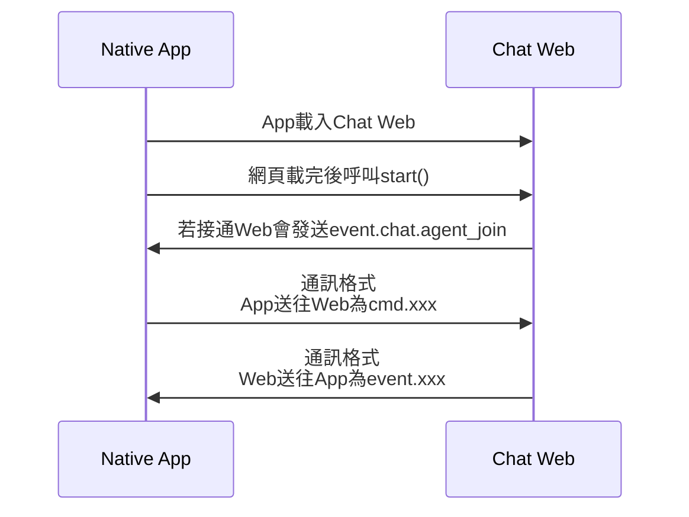

客服SSO架構開啟Web時的規格
=================
<!-- TOC -->

- [客服SSO架構開啟Web時的規格](#%E5%AE%A2%E6%9C%8Dsso%E6%9E%B6%E6%A7%8B%E9%96%8B%E5%95%9Fweb%E6%99%82%E7%9A%84%E8%A6%8F%E6%A0%BC)
- [Method](#method)
    - [迪普真人客服](#%E8%BF%AA%E6%99%AE%E7%9C%9F%E4%BA%BA%E5%AE%A2%E6%9C%8D)
    - [碩網智能文字客服](#%E7%A2%A9%E7%B6%B2%E6%99%BA%E8%83%BD%E6%96%87%E5%AD%97%E5%AE%A2%E6%9C%8D)
- [Request](#request)
    - [Ssotoken為null時](#ssotoken%E7%82%BAnull%E6%99%82)
        - [正常狀態下](#%E6%AD%A3%E5%B8%B8%E7%8B%80%E6%85%8B%E4%B8%8B)
            - [android](#android)
            - [ios](#ios)
        - [智能客服轉文字真人客服時](#%E6%99%BA%E8%83%BD%E5%AE%A2%E6%9C%8D%E8%BD%89%E6%96%87%E5%AD%97%E7%9C%9F%E4%BA%BA%E5%AE%A2%E6%9C%8D%E6%99%82)
            - [android](#android)
            - [ios](#ios)
    - [Ssotoken不為null時](#ssotoken%E4%B8%8D%E7%82%BAnull%E6%99%82)
        - [正常狀態下](#%E6%AD%A3%E5%B8%B8%E7%8B%80%E6%85%8B%E4%B8%8B)
        - [智能客服轉文字真人客服時](#%E6%99%BA%E8%83%BD%E5%AE%A2%E6%9C%8D%E8%BD%89%E6%96%87%E5%AD%97%E7%9C%9F%E4%BA%BA%E5%AE%A2%E6%9C%8D%E6%99%82)
    - [Skill](#skill)
- [App與客服Web的javascript protocol](#app%E8%88%87%E5%AE%A2%E6%9C%8Dweb%E7%9A%84javascript-protocol)
    - [App與客服Web的流程圖](#app%E8%88%87%E5%AE%A2%E6%9C%8Dweb%E7%9A%84%E6%B5%81%E7%A8%8B%E5%9C%96)
    - [App與客服Web的基本規格](#app%E8%88%87%E5%AE%A2%E6%9C%8Dweb%E7%9A%84%E5%9F%BA%E6%9C%AC%E8%A6%8F%E6%A0%BC)
    - [App發送command給客服Web時，客服Web的sendMessageparams: JsonString的JsonString規格](#app%E7%99%BC%E9%80%81command%E7%B5%A6%E5%AE%A2%E6%9C%8Dweb%E6%99%82%E5%AE%A2%E6%9C%8Dweb%E7%9A%84sendmessageparams-jsonstring%E7%9A%84jsonstring%E8%A6%8F%E6%A0%BC)
        - [App發送給迪普真人客服的command格式為cmd.xxx](#app%E7%99%BC%E9%80%81%E7%B5%A6%E8%BF%AA%E6%99%AE%E7%9C%9F%E4%BA%BA%E5%AE%A2%E6%9C%8D%E7%9A%84command%E6%A0%BC%E5%BC%8F%E7%82%BAcmdxxx)
    - [客服Web發送command給App時，App的postMessageparams: JsonString的JsonString的規格](#%E5%AE%A2%E6%9C%8Dweb%E7%99%BC%E9%80%81command%E7%B5%A6app%E6%99%82app%E7%9A%84postmessageparams-jsonstring%E7%9A%84jsonstring%E7%9A%84%E8%A6%8F%E6%A0%BC)
        - [迪普真人客服發送給App的command格式為event.xxx](#%E8%BF%AA%E6%99%AE%E7%9C%9F%E4%BA%BA%E5%AE%A2%E6%9C%8D%E7%99%BC%E9%80%81%E7%B5%A6app%E7%9A%84command%E6%A0%BC%E5%BC%8F%E7%82%BAeventxxx)
        - [碩網智能文字客服發送給App的command格式為event.xxx](#%E7%A2%A9%E7%B6%B2%E6%99%BA%E8%83%BD%E6%96%87%E5%AD%97%E5%AE%A2%E6%9C%8D%E7%99%BC%E9%80%81%E7%B5%A6app%E7%9A%84command%E6%A0%BC%E5%BC%8F%E7%82%BAeventxxx)

<!-- /TOC -->
# Method
## 迪普真人客服
| 項目 | 說明 |
| -----------------|------|
|Method|POST|
|Url(sit, uat)|https://appchat-u.nextbank.com.tw/UIMClient/Chat|
|Url(production)|https://appchat.nextbank.com.tw/UIMClient/Chat|
## 碩網智能文字客服
| 項目 | 說明 |
| -----------------|------|
|Method|POST|
|Url(sit, uat)|https://appbot-u.nextbank.com.tw/wise/webchat/Chat|
|Url(production)|https://appbot.nextbank.com.tw/wise/webchat/Chat|

# Request

| 階層 | 階層 | 欄位名稱 | M/O | 說明 |
| ----|-----|---------|-----|------|
|1||Ssotoken|O|使用者登入時認證身份的token(null時android不會將此Key傳出去，ios則會傳空字串）|
|1||Language|M|語言(目前均為Chinese)|
|1||Skill|M|根據不同的情況會使用不同的Skill，使用情境會在下方列出|
|1||Urgent|M|目前均為空字串|
|1||params|M||
||2|chat_id_robot|M|智能客服轉文字真人客服時需傳此參數給真人文字客服Web|

## Ssotoken為null時
### 正常狀態下
#### android
```json
{
   "Language": "Chinese",
   "Skill": "Generic",
   "Urgent": "",
   "params": {}
}
```
#### ios
```json
{
   "Ssotoken": "",
   "Language": "Chinese",
   "Skill": "Generic",
   "Urgent": "",
   "params": {}
}
```
### 智能客服轉文字真人客服時
#### android
```json
{
   "Language": "Chinese",
   "Skill": "Generic",
   "Urgent": "",
   "params": {
        "chat_id_robot": "123"
   }
}
```
#### ios
```json
{
   "Ssotoken": "",
   "Language": "Chinese",
   "Skill": "Generic",
   "Urgent": "",
   "params": {
        "chat_id_robot": "123"
   }
}
```
## Ssotoken不為null時
### 正常狀態下
```json
{
   "Ssotoken": "TUVNMWJmYjNmYTgxZTBhNGI1MDkwZWUzYjM4YjAyMDI0NWQ6NTMzNTJkZWMyYzQ2MTFlZWIyMmMwMDUwNTZhMjFmNzQuZ0xKWFNMOGEydURUdVpUdDRqaHNESTI0eUU0",
   "Language": "Chinese",
   "Skill": "Generic",
   "Urgent": "",
   "params": {}
}
```
### 智能客服轉文字真人客服時
```json
{
   "Ssotoken": "TUVNMWJmYjNmYTgxZTBhNGI1MDkwZWUzYjM4YjAyMDI0NWQ6NTMzNTJkZWMyYzQ2MTFlZWIyMmMwMDUwNTZhMjFmNzQuZ0xKWFNMOGEydURUdVpUdDRqaHNESTI0eUU0",
   "Language": "Chinese",
   "Skill": "Generic",
   "Urgent": "",
   "params": {
        "chat_id_robot": "123"
   }
}
```
## Skill

| Skill名稱 | 使用情境 | deep link action| deep link uri|deep link 目的地|
|-----------|--------|-----------------|---------------|------|
|Generic|迪普 -> 真人文字客服，碩網 -> 智能文字客服|
|GuaranTee|信貸簽約對保|guarantee|https://www.nextbank.com.tw/app/?action=guarantee|App 帳戶首頁(如圖一)|
|MobChg|變更手機號碼|mob_chg|https://www.nextbank.com.tw/app/?action=mob_chg|設定頁(如圖二)|
|AccUp|帳戶升級|acc_up|https://www.nextbank.com.tw/app/?action=acc_up|App 帳戶首頁(如圖一)|
|3APlus|調升非約定轉帳限額|3a_plus|https://www.nextbank.com.tw/app/?action=3a_plus|App 帳戶首頁(如圖一)|
|SetAgreeAcc|開啟約定轉帳|set_agree_acc|https://www.nextbank.com.tw/app/?action=set_agree_acc|App 帳戶首頁(如圖一)|
|PreDesAcc|驗證約定他人帳號|pre_des_acc|https://www.nextbank.com.tw/app/?action=pre_des_acc|App 帳戶首頁(如圖一)|
|Mortgage|房貸簽約對保|


# App與客服Web的javascript protocol
## App與客服Web的流程圖

## App與客服Web的基本規格
| 規格 | 說明 | 範例 |
|-----|------|-----|
|ncbmb|App instance name(javascript內需拿此instance呼叫APP原生method)|
|```start()```|javascript提供 start() method，網頁載完後App會呼叫start()，呼叫完start()才可執行```postMessage(params: JsonString)```和```sendMessage(params: JsonString)```|```start()```|
|```postMessage(params: JsonString)```|APP原生method，客服Web主動設定command給App(Web to App)，參數為一個json string，內含command, params兩個key|```ncbmb.postMessage('{ "command" : "event.chat.agentjoin", "params": {"agentid" : "AG0001", "chatid": "1223dxad3rf4ssdad"} }')```|
|```sendMessage(params: JsonString)```|javascript提供method讓APP呼叫，App主動設定command給客服Web(App to Web)，參數為一個json string，內含command, params兩個key|```sendMessage('{ "command" : "cmd.chat.end", "params":{} }')```|

> App目前沒有發送command給碩網智能客服


## App發送command給客服Web時，客服Web的```sendMessage(params: JsonString)```的JsonString規格
| 階層 | 階層 | 欄位名稱 | M/O | 說明 |
|-----|------|--------|------|-----|
| 1 | | command | M | App送往客服Web的指令 |
| 1 | | params | M | |
| | 2 | result | O | App送往客服的結果<br>"00" : 成功 <br>"01" : 失敗|
| | 2 | desc | O | App送往客服的結果<br>"succeeded" : 成功 <br>"failed" : 失敗|
| | 2 | user_message | O | App送往客服的訊息 |

### App發送給迪普真人客服的command(格式為cmd.xxx)

| command | 送出參數 | 說明 | 範例 |
| --------|---------|-----|---------|
|cmd.chat.end|沒有送出參數|離開文字客服|<pre>{<br>  "command": "cmd.chat.end",<br>  "params": {<br>   }<br>}|
|cmd.chat.channel_change_result|result<br>desc<br>user_message|客服人員想開啟視訊通話時，使用者回應的結果|<pre>{<br>  "command": "cmd.chat.channel_change_result",<br>  "params": {<br>      "result": "00",<br>      "desc": "succeeded"<br>      "user_message": "客戶同意開啟視訊"<br>   }<br>}|
|cmd.chat.keep_chat|沒有送出參數|繼續留在文字客服|<pre>{<br>  "command": "cmd.chat.keep_chat",<br>  "params": {<br>   }<br>}|

## 客服Web發送command給App時，App的```postMessage(params: JsonString)```的JsonString的規格

| 階層 | 階層 | 欄位名稱 | M/O | 說明 |
|-----|------|--------|------|-----|
| 1 | | command | M | 客服Web送往App的指令 |
| 1 | | params | M | |
| | 2 | agentid | O | 客服人員編號 |
| | 2 | result | O | 客服Web送往App的結果<br>"00" : 成功 <br>"01" : 失敗|
| | 2 | channel | O | 客服通話型態<br>"video" : 視訊客服 <br>"app_call" : 語音客服 <br>"chat_only" : 文字客服|
| | 2 | chatid | O | 聊天室紀錄編號 |
| | 2 | url | O | 接收url打開外部瀏覽器 |

### 迪普真人客服發送給App的command(格式為event.xxx)

| command | 回傳參數 | 說明 | 範例 |
| --------|---------|-----|---------|
|event.chat.agent_join|agentid<br>chatid|客服接通後|<pre>{<br>  "command": "event.chat.agent_join",<br>  "params": {<br>      "agentid": "AG0001",<br>      "chatid": "1223dxad3rf4ssdad"<br>   }<br>}|
|event.chat.agent_leave|不需要回傳參數|客服人員離開時|<pre>{<br>   "command": "event.chat.agent_leave",<br>   "params": {}<br>}|
|event.chat.agent_busy|不需要回傳參數|客服人員忙線中|<pre>{<br>   "command": "event.chat.agent_busy",<br>   "params": {}<br>}|
|event.chat.end|不需要回傳參數|結束客服時|<pre>{<br>   "command": "event.chat.end",<br>   "params": {}<br>}|
|event.chat.exit|不需要回傳參數|使用者要結束客服時，收到此event後會跳dialog讓使用決定要繼續留下還是結束客服|<pre>{<br>   "command": "event.chat.exit",<br>   "params": {}<br>}|
|event.mb.auth_request||目前沒有做事||
|event.mb.channel_change|channel|客服要更換Channel時(例：文字轉視訊)|<pre>{<br>  "command": "event.mb.channel_change",<br>  "params": {<br>      "channel": "video"<br>   }<br>}
|event.mb.questionnaire||目前沒有做事||
|event.mb.avaya_answer|不需要回傳參數|語音或視訊電話接通後|<pre>{<br>   "command": "event.mb.avaya_answer",<br>   "params": {}<br>}|
|event.mb.acc_upgrade_video|result|客服回傳帳戶升級結果|<pre>{<br>  "command": "event.mb.acc_upgrade_video",<br>  "params": {<br>      "result": "00"<br>   }<br>}|
|event.mb.loan_video|result|客服回傳貸款簽約結果|<pre>{<br>  "command": "event.mb.loan_video",<br>  "params": {<br>      "result": "00"<br>   }<br>}|
|event.mb.withdraw_limit_adj|result|客服回傳結果|<pre>{<br>  "command": "event.mb.withdraw_limit_adj",<br>  "params": {<br>      "result": "00"<br>   }<br>}|
|event.mb.credit_limit_adj|result|客服回傳結果|<pre>{<br>  "command": "event.mb.credit_limit_adj",<br>  "params": {<br>      "result": "00"<br>   }<br>}|
|event.mb.predefined_acc_apply|result|客服回傳新增約定帳號結果|<pre>{<br>  "command": "event.mb.predefined_acc_apply",<br>  "params": {<br>      "result": "00"<br>   }<br>}|
|event.chat.open_link|url|打開外部瀏覽器，並且將客服關閉|<pre>{<br>  "command": "event.chat.open_link",<br>  "params": {<br>      "url": "https://www.nextbank.com.tw/contact"<br>   }<br>}|

### 碩網智能文字客服發送給App的command(格式為event.xxx)
| command | 回傳參數 | 說明 | 範例 |
| --------|---------|-----|---------|
|event.ai.transfer_agent|chat_id_robot|智能客服轉文字真人客服|<pre>{<br>  "command": "event.ai_transfer_agent",<br>  "params": {<br>      "chat_id_robot" : "123"<br>   }<br>}|

